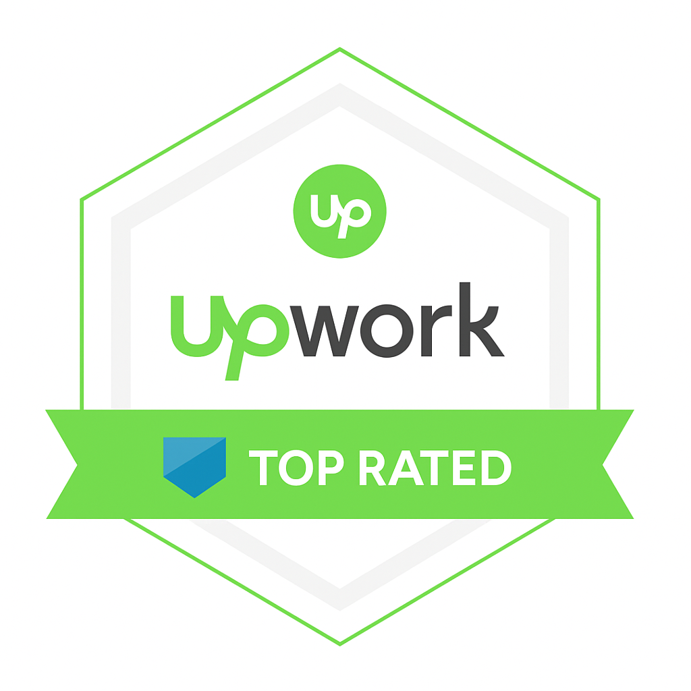

   

   
## Inside Scoop

 

I'm a JavaScript Developer focused on building scalable, high-performance web applications with React, Node.js, and Next.js. I’m passionate about finance, health, and technology, and I bring a detail-oriented mindset and strong grasp of the Software Development Lifecycle to every project. I thrive on solving complex problems through a balance of analytical thinking and creative engineering, consistently delivering clean, efficient, and maintainable code.
  
My toolkit includes RESTful APIs, server-side rendering, real-time features, and performance optimization using tools like Lighthouse and Chrome DevTools. I follow best practices in testing, version control, and code scalability, and I value strong communication and collaboration.
  
My goal is to join a forward-thinking team where I can build impactful digital products, grow alongside talented developers, and contribute to solving meaningful real-world problems through code.

  

##  Craft 

 

- **Software Engineer** - UnpairedSocks.org - *2024 - current (part time)*

  At UnpairedSocks.org, I lead the full-stack development team using Node.js, React, and Next.js to build scalable, high-performance systems. I focus on API integration, server-side rendering, and infrastructure optimization, leveraging tools like Lighthouse and DevTools for performance tuning. With a strong foundation in testing, system design, and problem-solving, I deliver clean, reliable code that supports long-term growth.

- **Open Source Contributor** - Naubly (Self Employed) - *2022 - current*

  I actively contribute to the open-source ecosystem through Node.js projects on npm and GitHub, including [`html-to-gutenberg`](https://www.npmjs.com/package/html-to-gutenberg), [`fetch-page-assets`](https://www.npmjs.com/package/fetch-page-assets), and [`node-html-to-jsx`](https://www.npmjs.com/package/node-html-to-jsx). I transform ideas into practical tools, promote collaboration, and help drive the developer community forward through clean, efficient Node.js code.

- **Full Stack Web Developer** - On Purpose Projects Agency - *2017 - 2021*

  Built and scaled high-traffic MERN stack applications, significantly increasing user engagement through responsive, dynamic interfaces.
Implemented CI/CD pipelines to streamline deployment, ensuring rapid and reliable release cycles.
Led a successful production launch with zero downtime, meeting performance and stability benchmarks.
Optimized backend and frontend performance for fast load times and smooth interactivity, using tools like Lighthouse and DevTools.

 

##  Knowledge Quest 

 

- **Computer Science** - Estácio de Sá - *2018 - 2019*
- **Economics** - Universidade Federal de Viçosa - *2012 - 2014* 
- **Software Engineering** - Instituto Federal de Educação, Ciência e Tecnologia - *2008 - 2010*
- **English Language** - Associação Cultural Brasil - Estados Unidos - *2004 - 2010* 

 

##  Tongues

 

- 🇧🇷 Português 
- 🇺🇸 English 
- 🇪🇸 Español
- 🇫🇷 Français

 

##  Array of services

 

|    **Design  ** |    **Backend Development**   |
|:---:|:---:|
|    **Frontend Development  ** |    **DevOps**   |

 

##  Tech Wizardry

 

 

## Coding Prowess

 

 

## My Showcase

 <table>
  <tr>
    <td align="center"><strong>Web Different</strong></td>
    <td align="center"><strong>My Freight</strong></td>
  </tr>
  <tr>
    <td align="center">
      
    </td>
    <td align="center">
      
    </td>
  </tr>

  <tr>
    <td align="center"><strong>Blitz Design 2.0</strong></td>
    <td align="center"><strong>Blitz Design</strong></td>
  </tr>
  <tr>
    <td align="center">
      
    </td>
    <td align="center">
      
    </td>
  </tr>

  <tr>
    <td align="center"><strong>Prophecy</strong></td>
    <td align="center"><strong>Speedio</strong></td>
  </tr>
  <tr>
    <td align="center">
      
    </td>
    <td align="center">
      
    </td>
  </tr>

  <tr>
    <td align="center"><strong>Portiflow</strong></td>
    <td align="center"><strong>B2B Software Advisors</strong></td>
  </tr>
  <tr>
    <td align="center">
      
    </td>
    <td align="center">
      
    </td>
  </tr>
</table>

 

##  Achievement Trophies

| **Upwork Top Rated** | **Mentor** | **Machine Learning** |
|---|---|---|
|  |  |  |
| **WordPress Expert** | **Meteor & React** | **Advanced English** |
|  |  |  |

 

 

## <a name="reviews"> Client Chronicles </a>

 

 

  
<b>Add Date Filtering to Plugin</b> 08 Dec 2021 ⭐⭐⭐⭐⭐

   
  Diogo delivered above and beyond what was expected. 
    
  Paul Morin

 

  
<b>PaidMembershipPro to Paid Member Subscriptions</b> 29 Nov 2021 ⭐⭐⭐⭐⭐

   
  Diogo was fantastic and went above and beyond my expectations. He worked until all hours of the night getting a mission-critical project finished and anticipated possible challenges. I'm ready to hire him for my next project!
    
  
   
  Robert Johnson

 

  
<b>I need some coding.</b> 19 Nov 2021 ⭐⭐⭐⭐⭐

   
  Diogo is very efficient. He listened patiently to all my needs and helped me to accomplish exactly what I wanted. And he always replied within an hour! This is amazing. 
    
  
   
  Carman Chung

 

  
<b>Pushing Local Pickup Plus options to Shipping.</b> 01 Nov 2021 ⭐⭐⭐⭐⭐

   
  Fast, and super easy to work with. Work was completed to a high standard.
    
  
   
  Adam Selley

 

  
<b>I need help architecting a 10,000-page site with data-generated pages connected to external APIs.</b> 19 Oct 2021 ⭐⭐⭐⭐⭐

   
  Helpful call with Diogo as he helped me scope out my project and contributed new and interesting insights that can be used in the project! 
    
  
   
  Joe Robison

 

  
<b>I need spring cleaning on my WordPress website.</b> 07 Oct 2021 ⭐⭐⭐⭐⭐

   
  Diogo is the website help I have been looking for. By far the best person I've hired yet to help me. 
    
  
   
  Shane Baker

 

  
<b>Fix Issues after creating Ajax user profile (Ultimate Member - User Profile & Membership Plugin.)</b> 24 Aug 2021 ⭐⭐⭐⭐⭐

   
  In addition to the original scope of the project, there were many additional tasks, and we managed to accomplish a lot. Communication was at the highest level. Even when we encountered obstacles, finding a common solution was not a problem. I am sure that after this project, we both had some valuable takeaways. Great job! 
    
  
   
  Rudolfs Dzenis

 

  
<b>WordPress customization</b> 01 Nov 2019 ⭐⭐⭐⭐⭐

   
  I've been hiring developers for years, but Diogo is by far the best one I've ever worked with. He is always available to talk and always sends updates regarding the project. If all developers were like him, it would make my life much easier.
  
  The code and consistency of the project were amazing, and it surprised the management with all the suggestions he gave us. The project was delivered 2 days before the deadline.
  
  Will be hiring again for sure!
  
  Thanks Diogo!
   
  Matheus Oliveira

 

  
<b>Text animation using CSS and JavaScript</b> 05 Jun 2019 ⭐⭐⭐⭐⭐

   
  Diogo did an excellent job and came up with great workarounds to challenges.
  Great to have a developer who understands design.
  
  Will work with Diogo again for sure!
    
  
   
  Jenna Farrell

 

  
<b>Website edits and custom animation</b> 01 Apr 2019 ⭐⭐⭐⭐⭐

   
  Diogo does excellent website work and always delivers on time. I appreciate that he works very hard to deliver top quality.
    
  
   
  Natasha Golinsky

  

## <a name="reviews"> Reach Out </a>

 

  
