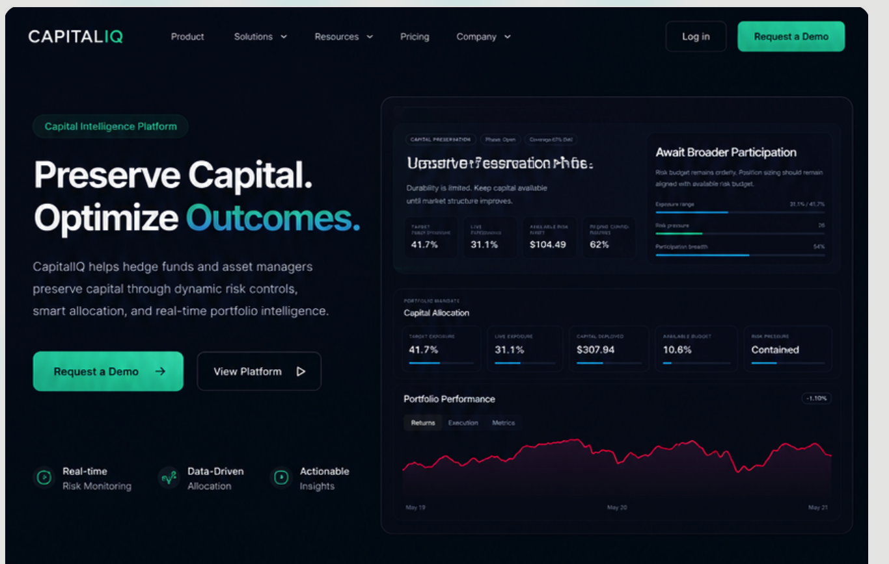

[](https://linkedin.com/in/diogoangelim)

<br><br><br>

## About

<br>

> **I'm a Founding AI Engineer. I design the AI layer, architect the backend, and ship the product — end to end.**

<br>

I founded [Naubly](https://naubly.com), an AI-powered investment platform, and built it from scratch: the decision-quality model, the data pipelines, the backend, and the React frontend. To do it correctly, I designed and open-sourced [Signal](https://github.com/DiogoAngelim/signal) — a production correctness standard that makes backend mutations idempotency-safe, replay-protected, and auditable. Signal is the operational backbone Naubly runs on.

Before that I spent four years in high-traffic web platforms and two years as a certified [Codeable](https://www.credential.net/58930281-2568-48db-a5df-a85e40244d6e?record_view=true) WordPress engineer — a network that screens applicants through a multi-stage technical review. I also contributed to a .NET ERP system that processes transactions at enterprise scale.

I write TypeScript, Python, Rust, and SQL. I understand how to build things that stay correct under real load.

<br>

## Core Technologies

<br>

### Core Languages & Frameworks


### Data, AI & Visualization


### Databases


### Infrastructure, Cloud & DevOps


### APIs, Automation & Platforms


<br><br>

## <a name="work"></a> Experience

<br>

- **Founding AI Engineer** — [Naubly](https://naubly.com) — *2019 – present*

  Founded and built an AI-powered investment platform for retail investors. Designed the decision-quality model — an evidence-based, uncertainty-aware judgment system that tracks assumptions, contradictions, and reviewable learning across investment decisions. Architected and shipped the full product: data ingestion pipelines, backend API, and React frontend.

  To make financial state changes safe under retries and replays, I designed [Signal](https://github.com/DiogoAngelim/signal) — a production correctness standard for versioned, idempotency-safe, auditable backend operations — and wired it in as Naubly's operational core. The live application is at [stocks-optimizer.vercel.app](https://stocks-optimizer.vercel.app). Early users reported meaningfully better risk-adjusted outcomes compared to their previous approach.

- **Software Engineer** — Union Sistemas de Desenvolvimento — *2025*

  Contributed to an enterprise .NET ERP system handling high-volume financial transactions for companies with international operations. Added new features, resolved complex bugs, and worked directly with stakeholders to translate business logic into reliable code. Identified and resolved accounting mismatches in critical transaction paths — errors that, left undetected, would have caused material financial discrepancies. Delivered changes through rigorous debugging and iterative testing within a large existing codebase.

- **Software Engineer** — [Codeable](https://www.credential.net/58930281-2568-48db-a5df-a85e40244d6e?record_view=true) Aps — *2021 – 2022*

  Codeable is a curated WordPress engineering network with a multi-stage technical screening process — credential [verifiable here](https://www.credential.net/58930281-2568-48db-a5df-a85e40244d6e?record_view=true). Built custom plugins, implemented API integrations, and delivered secure e-commerce solutions for international clients. Designed and executed a payment processor migration for over 300 active subscribers — zero data loss, delivered on schedule. Consistently high client satisfaction, as reflected in the reviews below.

- **Software Engineer** — On Purpose Projects — *2017 – 2021*

  Built and scaled web platforms from initial build to high-traffic production across four years of client work. Engineered architectures capable of sustaining large concurrent visitor loads, implemented security measures across client systems, and improved page performance through targeted optimizations. Established documentation and coding standards that reduced handoff time across projects.

<br>

## <a name="opensource"></a> Open Source

<br>

**[Signal](https://github.com/DiogoAngelim/signal)** — A production correctness standard for dangerous backend operations.

Signal makes mutations idempotency-safe, replay-protected, and auditable. It defines explicit contracts for Queries, Mutations, and Events, with stable names, schemas, idempotency enforcement, subscriber dedupe, and audit evidence. Built as a TypeScript monorepo with a full protocol spec layer, CI/CD pipelines, a Postgres-backed idempotency store, and a runnable reference proof. The docs are [1,175 lines](https://github.com/DiogoAngelim/signal/blob/main/docs/README.md) covering architecture, module catalog, HTTP binding, runtime usage, and production operating guidelines. You can run the entire reference proof — including a live payment-capture mutation with retry, replay, conflict, and audit observation — in under five minutes:

```sh
pnpm install && pnpm proof:reference
```

Live examples: [stocks-optimizer.vercel.app](https://stocks-optimizer.vercel.app) · [aware-guide.vercel.app](https://aware-guide.vercel.app)

---

**[html-to-gutenberg](https://github.com/DiogoAngelim/html-to-gutenberg)** — Converts raw HTML into fully editable WordPress Gutenberg blocks.

Published as an npm package (`npm install html-to-gutenberg`). Supports Cloudflare R2 output with in-memory zipping, a job manifest API, CI via GitHub Actions, TypeScript types, test coverage, and a backwards-compatible legacy mode for existing toolchains.

---

**[fetch-page-assets](https://github.com/DiogoAngelim/fetch-page-assets)** — Node.js utility for extracting and normalizing CSS, JS, fonts, and images from HTML pages and URLs, with direct R2 upload support.

<br>

## <a name="education"></a> Education

<br>

I studied across three technical programs — Computer Science (Estácio de Sá), Software Engineering (Instituto Federal), and Economics (Universidade Federal de Viçosa) — and left each to work in production engineering. The economics background directly informs the quantitative and portfolio modeling work in Naubly. Six years of advanced English study (Associação Cultural Brasil–Estados Unidos, 2004–2010) brings full professional fluency.

<br/>

## <a name="portfolio"></a> Portfolio

<br/>
<table>
  <tr>
    <td align="center"><strong>capitalIQ</strong></td>
    <td align="center"><strong>AlgAI</strong></td>
  </tr>
  <tr>
    <td align="center">
      <a href="https://stocks-optimizer.vercel.app/" target="_blank">
        
      </a>
    </td>
    <td align="center">
      <a href="#" target="_blank">
        
      </a>
    </td>
  </tr>
  <tr>
    <td align="center"><strong>Web Different</strong></td>
    <td align="center"><strong>My Freight</strong></td>
  </tr>
  <tr>
    <td align="center">
      <a href="https://web.archive.org/web/20241001053257/https://webdifferent.com.au/" target="_blank">
        
      </a>
    </td>
    <td align="center">
      <a href="https://web.archive.org/web/20230326034929/https://myfreight.com.au/" target="_blank">
        
      </a>
    </td>
  </tr>
  <tr>
    <td align="center"><strong>Blitz Design 2.0</strong></td>
    <td align="center"><strong>Blitz Design</strong></td>
  </tr>
  <tr>
    <td align="center">
      <a href="https://web.archive.org/web/20220301044510/https://blitzmdesign.com.au/" target="_blank">
        
      </a>
    </td>
    <td align="center">
      <a href="https://codepen.io/digelim/pen/wbOggK" target="_blank">
        
      </a>
    </td>
  </tr>
  <tr>
    <td align="center"><strong>Prophecy</strong></td>
    <td align="center"><strong>B2B Software Advisors</strong></td>
  </tr>
  <tr>
    <td align="center">
      <a href="https://web.archive.org/web/20200811001303/https://www.prophecy.io/product-page" target="_blank">
        
      </a>
    </td>
    <td align="center">
      <a href="https://b2bsoftwareadvisors.com/" target="_blank">
        
      </a>
    </td>
  </tr>
</table>

<br/>

## <a name="recognition"></a> Certifications & Recognition

<br><br>
<table>
  <tr>
    <th>Mentor</th>
    <th>WordPress Expert</th>
  </tr>
  <tr>
    <td>
      <a href="https://www.codementor.io/@diogo_angelim?refer=badge">
        
      </a>
    </td>
    <td>
      <a href="https://www.credential.net/58930281-2568-48db-a5df-a85e40244d6e?record_view=true" target="_blank">
        
      </a>
    </td>
  </tr>
  <tr>
    <th>Machine Learning</th>
    <th>Advanced English</th>
  </tr>
  <tr>
    <td>
      <a href="https://www.coursera.org/account/accomplishments/verify/5TLHGJPFYLGR" target="_blank">
        
      </a>
    </td>
    <td>
      <a href="https://acbeujf.com.br/" target="_blank">
        
      </a>
    </td>
  </tr>
</table>

<br/>

## Feedback <a name="reviews"></a>

<br/>

### ⭐⭐⭐⭐⭐ Add Date Filtering to Plugin
**08 Dec 2021**

Diogo delivered above and beyond what was expected.

**Paul Morin**

---

### ⭐⭐⭐⭐⭐ PaidMembershipPro to Paid Member Subscriptions
**29 Nov 2021**

Diogo was fantastic and went above and beyond my expectations.
He worked until all hours of the night getting a mission-critical project finished and anticipated possible challenges.
I'm ready to hire him for my next project!


**Robert Johnson**

---

### ⭐⭐⭐⭐⭐ I need some coding
**19 Nov 2021**

Diogo is very efficient. He listened patiently to all my needs and helped me accomplish exactly what I wanted.
He always replied within an hour! This is amazing.


**Carman Chung**

---

### ⭐⭐⭐⭐⭐ Pushing Local Pickup Plus options to Shipping
**01 Nov 2021**

Fast and super easy to work with.
Work was completed to a high standard.


**Adam Selley**

<br/>

## Reach Out

[](mailto:hello@diogoangelim.dev)
[](https://linkedin.com/in/diogoangelim)
[](https://naubly.com)
[](https://github.com/diogoangelim)

<br/><br/>
